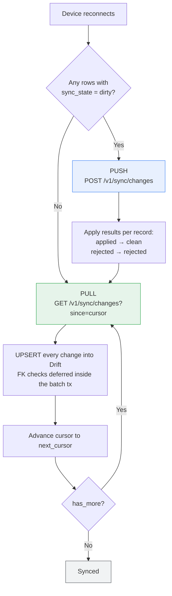
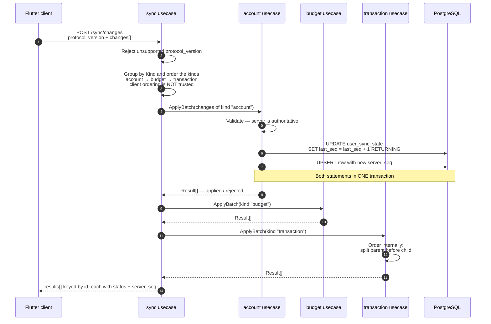
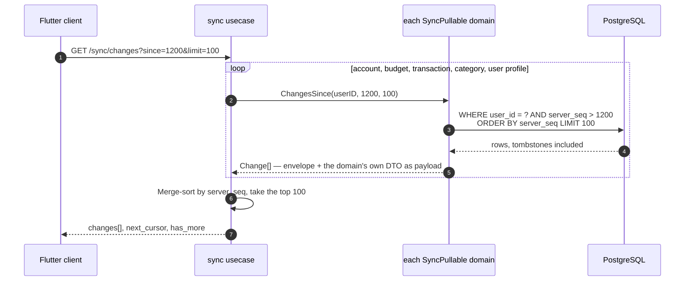
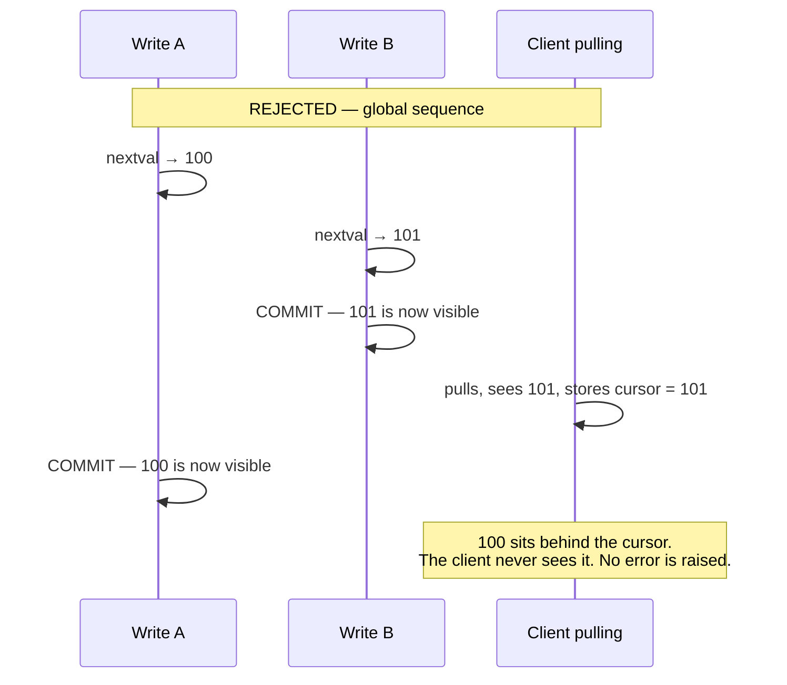
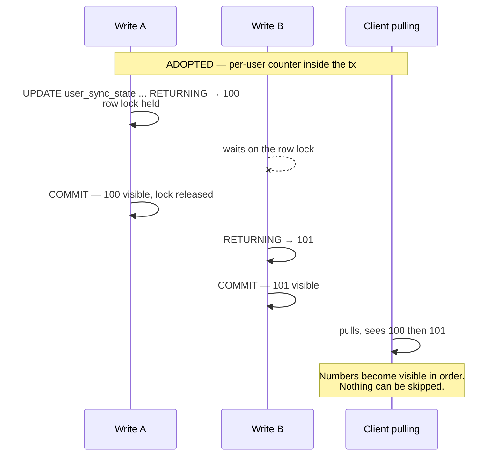
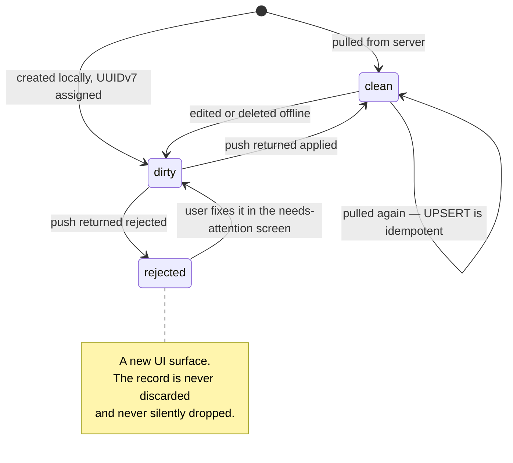
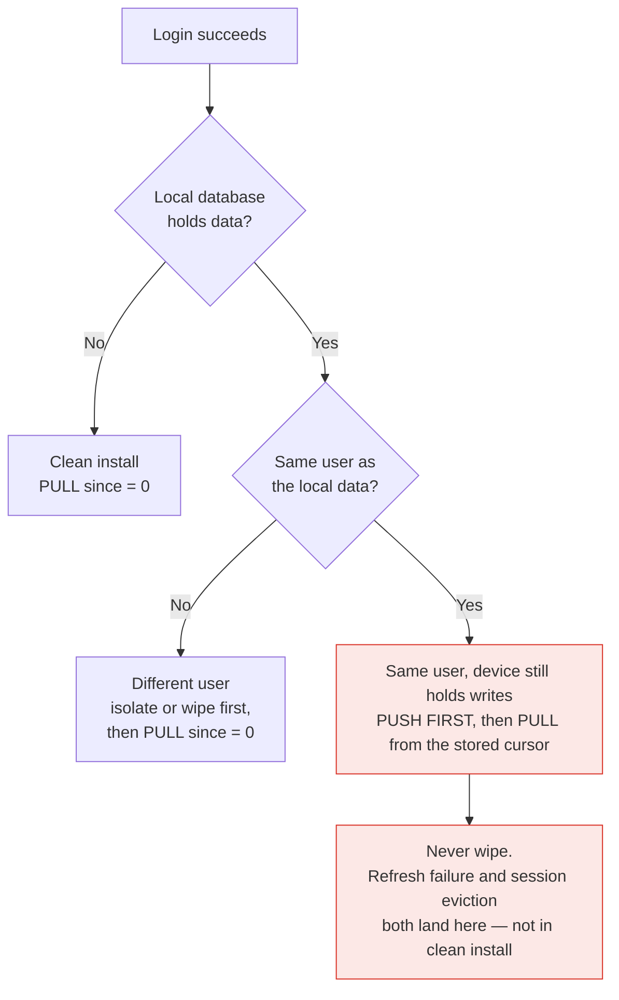

# Sync mechanism — flow diagrams

Companion to `ADR-0003-offline-first-sync-and-receipt-scan.md`. The ADR records *why*; this
file shows *how it runs*. Decisions shown here come from ADR §2.2–§2.9 and §2.11–§2.13.

Nothing here is a new decision. Where something is still open it is marked **OPEN**.

---

## 1. What the mechanism is made of

Three pieces of bookkeeping, and nothing else.

| Where | What | Purpose |
|---|---|---|
| Every synced row, both sides | `id` (client UUIDv7), `updated_at`, `deleted_at`, `server_seq` | Identity, tombstone, position |
| Server, one row per user | `user_sync_state.last_seq` | The sequence generator |
| Client, one value | `last_synced_seq` | The cursor — how far this device has seen |
| Client, per row | `sync_state`: `clean` / `dirty` / `rejected` | What still needs pushing |

The whole protocol follows from one rule:

> Whenever the server writes anything belonging to a user, it increments that user's
> `last_seq` and stamps the new value onto the row it wrote.

So *"what changed since I last looked"* is just `WHERE server_seq > cursor`. There is no
changelog, no device table, no version history.

---

## 2. The full cycle on reconnect

Push always runs before pull. That ordering is what protects unsynced local writes.

The device re-receives its own pushed rows in the following pull. That is harmless and
deliberate: apply is an idempotent UPSERT, so a retry from the old cursor is always safe.

---

## 3. Push — client to server

Push carries business rules, so it goes through each domain's own usecase. The server
re-validates everything (ADR §2.8).

Categories and user profile are **absent by construction** — they are pull-only, so they have
no `SyncPushable` implementation and therefore no push door at all (ADR §2.11).

**OPEN (item 1.5):** what happens when one record inside a batch is rejected — whole batch
rolled back, or the rest still applied — and whether `conflict` means anything at all on a
single-device product. The diagram shows only `applied` / `rejected`.

---

## 4. Pull — server to client

Pull has no business rules; it is pure projection of current state.

Each unit is queried for `n` rows to return `n` overall. The over-fetch is immaterial at this
data volume, and it is what keeps the cursor a single `int64` instead of a compound cursor
(ADR §2.11).

A tombstone is not a special case: a deleted row has `deleted_at` set and a bumped
`server_seq`, so it flows through the same query as any other change.

---

## 5. Why the sequence comes from a per-user counter

The generator choice is not cosmetic. A global Postgres sequence loses records silently,
because the number is taken *before* the commit becomes visible.

Contention is one row lock per write per user — effectively zero on a single-device product.

---

## 6. Record lifecycle on the client

Deletion is not a state here. A deleted record sets `deleted_at` and goes `clean → dirty` like
any other edit; the tombstone then syncs as ordinary data.

---

## 7. Login — the three cases that must not collapse

This is where data is actually at risk (ADR §2.9).

The middle branch is the common one in practice and the primary data-loss risk. An expired
refresh token or a session evicted by the max-10 soft limit must never be mistaken for a clean
install.

---

## 8. Note on ADR §2.4

§2.4 states the required order as
`accounts → categories (parent before child) → budgets → transactions`
and applies it to both push and hydration. Since §2.7 made categories pull-only, categories
cannot appear on the push path at all. The two orders are different:

- **Push (client → server):** accounts → budgets → transactions
- **Apply on pull (server → client):** accounts → categories → budgets → transactions

The diagrams above follow that split. §2.4 should be reworded to match — flagged, not yet
changed.
